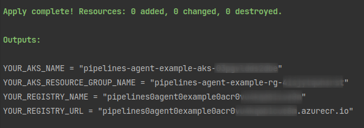

# Self-Host Your Azure Pipeline Agents in Kubernetes and Scale Them On Demand (example)

## Prerequisites
- a kubernetes cluster
- a container registry
- kubectl
- helm
- helmfile

## 00 - Azure Infrastructure (optional)

### Prerequisites
- Terraform
- Azure Subscription

If you don't already have your infrastructure setup, you can use this Terraform project to create:
1. Azure Kubernetes Service (AKS)
2. Azure Container Registry (ACR)
3. Access policy to pull images from ACR in AKS

To create the infrastructure, open a terminal in the `./00-infrastructure` directory and execute the following:

```bash
terraform init
terraform apply
```

Once completed, the Terraform will output the required values you will need later on:



## 01 - Image

### Prerequisites
- Container registry

First login to your registry.  For Azure Container Registries, use the following:

`az acr login --name <YOUR_REGISTRY_NAME>`

The build and push your Pipeline Agent Image with the following commands:

`docker build -t <YOUR_REGISTRY_URL>/pipeline_agent`

`docker push <YOUR_REGISTRY_URL>/pipeline_agent`

## 02 - Kubernetes

First, authenticate to your k8s cluster and set the context.  If you're using AKS, authentication using the Azure CLI:

`az aks get-credentials -g <YOUR_AKS_RESOURCE_GROUP_NAME> -n <YOUR_AKS_NAME>`

```bash
export YOUR_REGISTRY_URL=<YOUR_REGISTRY_URL>
export YOUR_AZP_URL=<YOUR_AZP_URL>
export YOUR_AZP_POOL=<YOUR_AZP_POOL>
export YOUR_AZP_PAT=<YOUR_AZP_PAT>

helmfile -f ./keda.yaml apply
helmfile -f ./agent.yaml apply
```